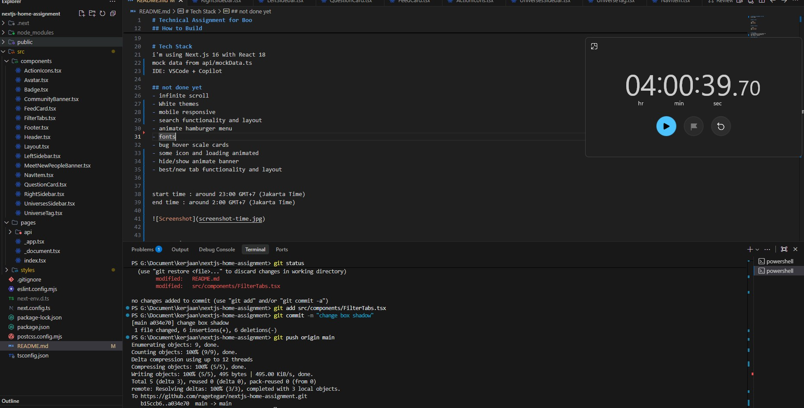

# Technical Assignment for Boo
08 Jan 2026


## How to Run

```bash
npm install
npm run dev
```

## How to Build

```bash
npm run build
npm run start
```


# Tech Stack
i'm using Next.js 16 with React 18
mock data from api/mockData.ts 
IDE: VSCode + Copilot 

## not done yet
- infinite scroll
- White themes
- mobile responsive
- search functionality and layout
- animate hamburger menu    
- fonts
- bug hover scale cards
- some icon and loading animated
- hide/show animate banner
- best/new tab functionality and layout


start time : around 23:00 GMT+7 (Jakarta Time)
end time : around 2:00 GMT+7 (Jakarta Time)




Tegar Ari pranata
ragetegar.com